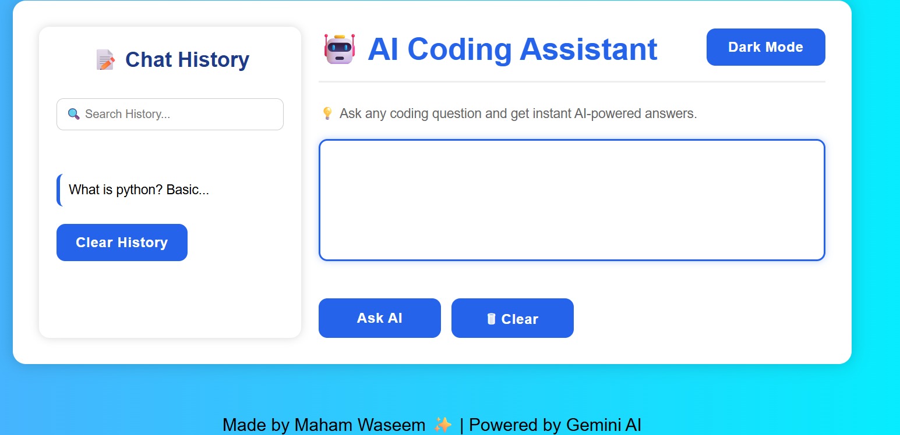
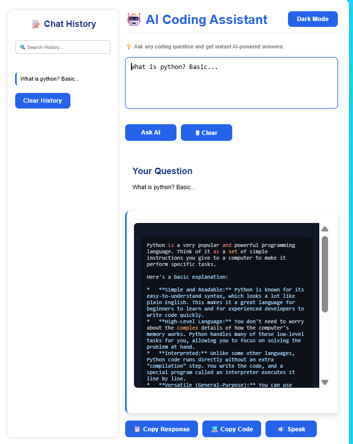
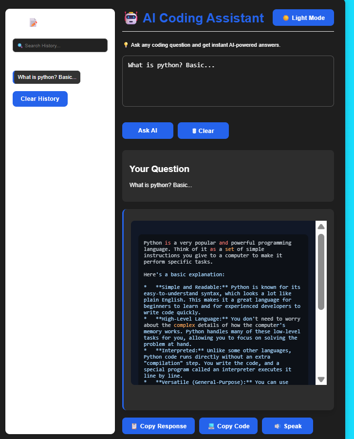

# 🤖 AI Coding Assistant

An AI-powered coding assistant built using **Python, Flask, HTML, CSS, JavaScript, and Gemini AI**. It helps users ask coding questions and receive instant AI-generated responses through a clean and responsive web interface.

## 📌 Project Overview

This project is designed to help programmers and students solve coding-related problems quickly using AI. It provides a modern interface with useful features like chat history, dark mode, syntax highlighting, copy options, speech output.
 
 ## ✨ Features

- 🤖 AI-powered coding assistant
- 🌙 Dark Mode
- 📝 Chat History
- 🔍 Search History
- 📋 Copy AI Response
- 💻 Copy Code
- 🔊 Text-to-Speech
- 🎨 Syntax Highlighting
- 📱 Responsive Design

## 🛠 Tech Stack

**Frontend**
- HTML5
- CSS3
- JavaScript

**Backend**
- Python
- Flask

**AI Model**
- Gemini AI API

**Libraries**
- jsPDF
- Highlight.js
- Web Speech API

## ⚙️ Installation

```bash
git clone https://github.com/Maham-coree/AI-Coding-Assistant-.git

cd AI-Coding-Assistant-

pip install -r requirements.txt

python app.py
```

Create a `.env` file and add:

```env
GEMINI_API_KEY=YOUR_API_KEY
```

Open:

```text
http://127.0.0.1:5000
```

## 🚀 How to Use

1. Enter your coding question.
2. Click **Ask AI**.
3. View the AI-generated response.
4. Copy the response or code.
5. Use **Dark Mode** or **Speak** for a better experience.

## 📸 Screenshots

### 🏠 Home Page



---

### 🤖 AI Response



---

### 🌙 Dark Mode



## 🔮 Future Improvements

- User Login System
- Save Chat History in Database
- Voice Input Support
- Multiple AI Models
- Mobile App Version


## 👩‍💻 Author

**Maham Waseem**

Passionate about AI, Python, and Software Development.

GitHub: https://github.com/Maham-coree

LinkedIn: https://www.linkedin.com/in/maham-waseem-89735134a?